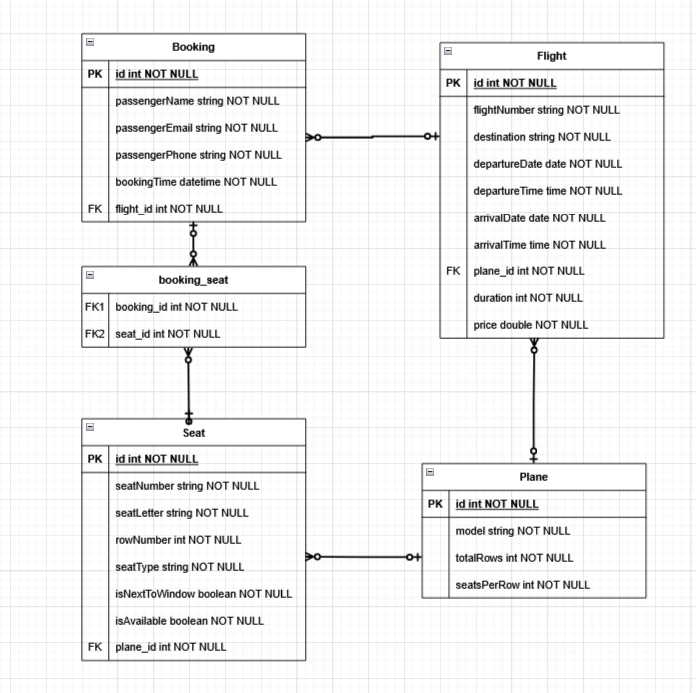

# This is a Flights and Seats application made for CGI as part of their application process.

While I didn't have time to implement proper business logic, the project does, however, have a scalable backend, and a frontend that displays flights. When a flight's book button is clicked on, it directs to a booking page that shows seats.

**How to use:**

1. Open the project in IntelliJ IDEA.

2. Run the following command to start the backend and the in-memory database: ``gradle bootrun``.

3. Navigate to the ``./frontend/flights-and-seats-front`` directory and start the frontend: ``npm run dev``.

4. Access the application at the recommended URL: http://localhost:3000. The backend operates at http://localhost:8080.

**How much was AI used?**

I leveraged AI tools extensively during this project for:

* Generating instructions and explanations to build a better understanding.

* Creating boilerplate code and tackling complex problems.

While AI played a supportive role, I did write a lot of the code myself. The code I did get I reviewed and adapted to my needs. This approach allowed me to learn effectively, using AI a useful and personal helper. The tools I relied on included:
* ChatGPT
* Copilot (it was especially great for troubleshooting smaller questions; I had many new instances of Copilot open just to clarify details)
* Gemini

**Time spent on this**

Approximately 15+ hours.

**Used stack**
* **Backend:** Spring Boot, JPA
* **Frontend:** Next.js (with TypeScript), React

**Used libraries**

* Material-UI (https://mui.com/material-ui/react-table/)

**Database schema**

(The database schema diagram image is included as `db_schema.png` in the same directory as this README file.)